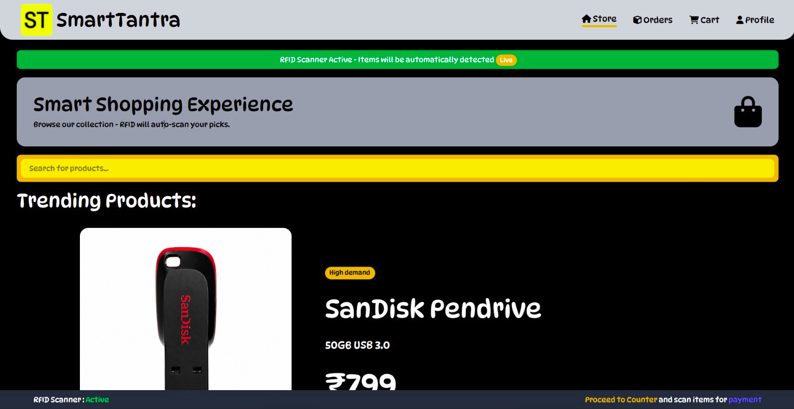
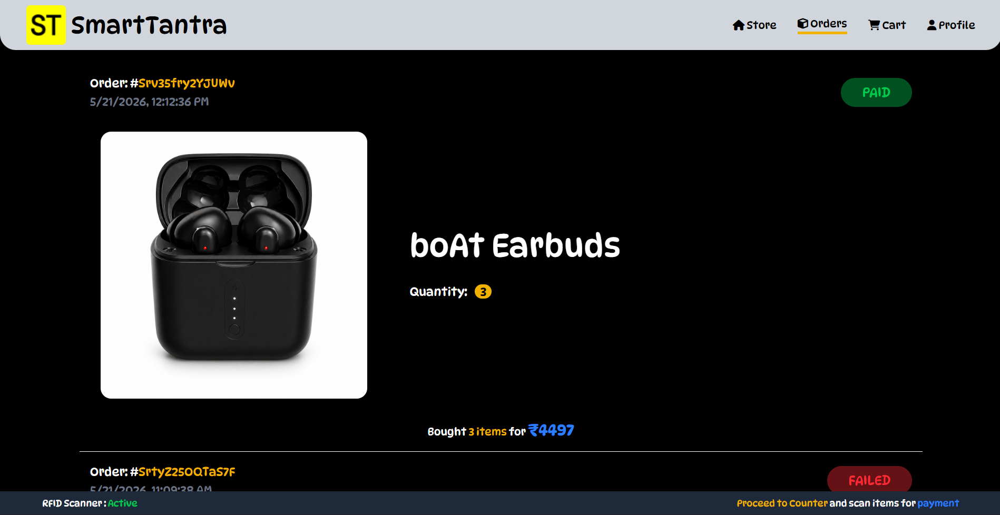
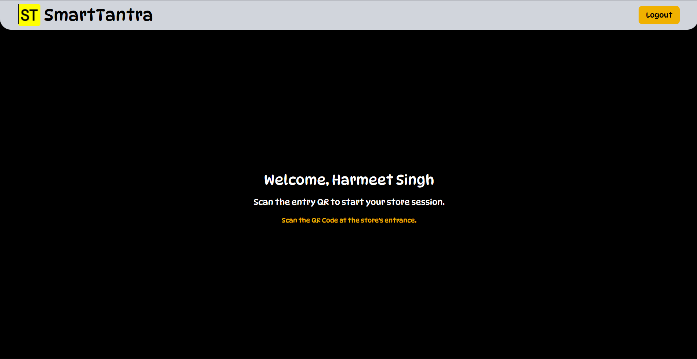
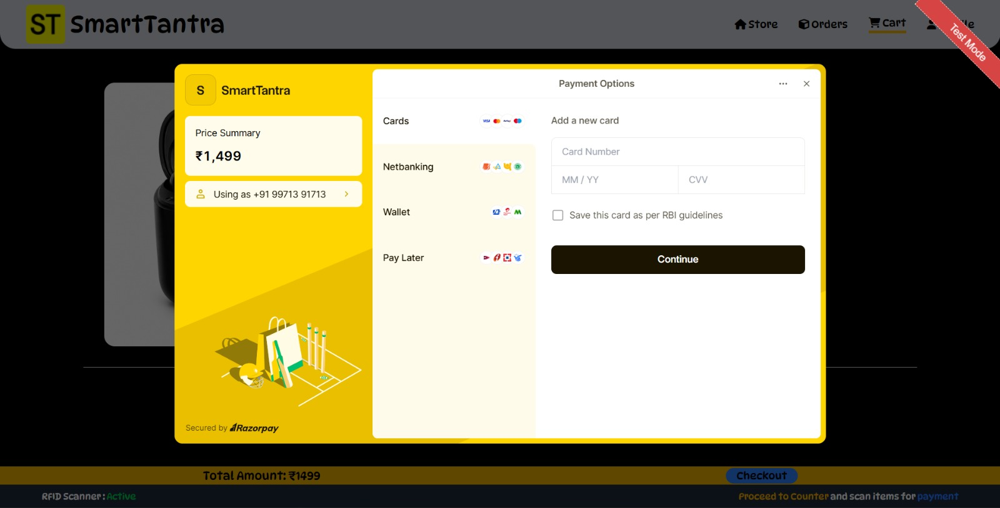
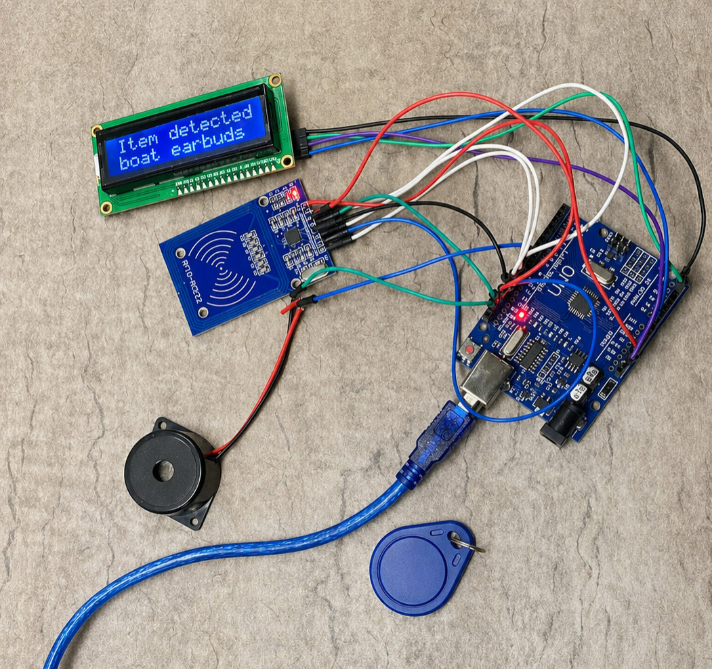

# SmartTantra

SmartTantra is an IoT-powered smart retail checkout system built using the MERN stack and RFID technology. The system allows users to scan RFID-tagged products in real time, automatically manage cart sessions, and complete secure online payments using Razorpay.

The project simulates a modern cashier-less shopping experience where products are detected through RFID scanning and synchronized instantly with the web application.

---

# Features

## RFID-Based Product Scanning
- Real-time RFID tag scanning using Arduino + MFRC522
- Automatic cart updates
- Duplicate scan prevention
- Buzzer feedback on successful scans

## Smart Session Management
- One active shopping session per user
- Session expiration and completion handling
- Counter-based session allocation

## Secure Authentication
- JWT-based authentication
- Protected routes and middleware
- Session validation

## Smart Cart System
- Add products automatically through RFID
- Quantity management
- Dynamic cart updates

## Payment Integration
- Razorpay payment gateway integration
- Payment verification using signature validation
- Failed payment handling
- Order receipt generation

## Order Management
- Order history
- Payment status tracking
- Product quantity tracking
- Automatic stock reduction after successful purchase

## Receipt System
- Temporary receipt page
- Printable/downloadable receipts
- Payment confirmation flow

---

# Tech Stack

## Frontend
- React.js
- Vite
- Tailwind CSS
- React Router
- Axios
- Lucide React
- Framer/Motion Scroll Animations

## Backend
- Node.js
- Express.js
- MongoDB
- Mongoose
- JWT Authentication

## IoT & Hardware
- Arduino Uno
- MFRC522 RFID Module
- RFID Tags/Cards
- Buzzer Module

## Payment Gateway
- Razorpay

---

# System Architecture

```text
RFID Tag
   ↓
Arduino + MFRC522
   ↓
Serial Communication
   ↓
Node.js Serial Bridge
   ↓
Express Backend API
   ↓
MongoDB Database
   ↓
React Frontend
```

---

# RFID Workflow

1. User starts a shopping session
2. RFID-tagged product is scanned
3. Arduino reads RFID UID
4. UID is sent to backend through serial bridge
5. Backend matches RFID with product
6. Product is added to active session cart
7. Cart updates instantly on frontend
8. User completes payment using Razorpay
9. Order is stored in database
10. Session is completed automatically

---

# Project Structure

```text
SmartTantra/
│
├── Client/
│   ├── src/
│   ├── components/
│   ├── pages/
│   ├── services/
│   ├── utils/
│   └── layouts/
│
├── Server/
│   ├── controllers/
│   ├── routes/
│   ├── middleware/
│   ├── models/
│   ├── config/
│   ├── scripts/
│   ├── utils/
│   └── .env
│
└── IoT/
    ├── Ardiuno/
        └── basics.ino
    └── node_bridge/
        └── serial.js
```

---

# Installation

## Clone Repository

```bash
git clone https://github.com/your-username/SmartTantra.git
cd SmartTantra
```

---

# Backend Setup

```bash
cd Server
npm install
```

Create `.env`

```env
PORT=5000

MONGO_URI=your_mongodb_uri

JWT_SECRET=your_secret

RAZORPAY_KEY_ID=your_key
RAZORPAY_KEY_SECRET=your_secret

STORE_TOKEN=your_store_token
```

Run backend:

```bash
npm run dev
```

---

# Frontend Setup

```bash
cd Client
npm install
```

Create `.env`

```env
VITE_API_URL=http://localhost:5000
VITE_RAZORPAY_KEY=your_razorpay_key
```

Run frontend:

```bash
npm run dev
```

---

# Arduino Setup

## Required Libraries
- MFRC522
- SPI

## Hardware Connections

### MFRC522 → Arduino Uno

| RFID Module | Arduino |
|---|---|
| SDA | D10 |
| SCK | D13 |
| MOSI | D11 |
| MISO | D12 |
| RST | D9 |
| 3.3V | 3.3V |
| GND | GND |

### Buzzer → Arduino

| Buzzer | Arduino |
|---|---|
| Positive (+) | D8 |
| Negative (-) | GND |

Upload RFID scanner code using Arduino IDE.

---

# API Endpoints

## Authentication
- `POST /auth/register`
- `POST /auth/login`

## Sessions
- `POST /session/create`
- `GET /session/current`

## RFID
- `POST /rfid/add-item`

## Payments
- `POST /payment/create-order`
- `POST /payment/verify`
- `POST /payment/mark-failed`

## Orders
- `GET /orders/history`

---

# Key Learning Outcomes

- RFID integration with MERN stack
- IoT to web communication
- Real-time cart synchronization
- Payment gateway integration
- Session lifecycle management
- Hardware + software integration
- Backend architecture and middleware handling

---

# Future Improvements

- QR-based receipt verification
- Email receipts
- Admin dashboard
- Analytics system
- WebSocket-based real-time sync
- Industrial RFID support
- Multi-counter scalability
- AI-powered shopping insights

---

# Important Note

This project includes RFID-based IoT hardware integration using Arduino and MFRC522.

While the web application can be hosted normally, the RFID scanning functionality requires physical hardware and local serial communication, therefore it cannot be fully demonstrated through cloud hosting alone.

A demo video/screenshots of the RFID workflow are recommended for complete demonstration.

---

# Screenshots

User Store Homepage: 


Order History:


User store's entry page (where QR code needs to be scanned):


Guest Homepage:


Payment Page:


IoT Ardiuno Board with RFID Scanner and MFRC522:


---

# Author

Harmeet Singh

---

# License

This project is for educational and academic purposes.